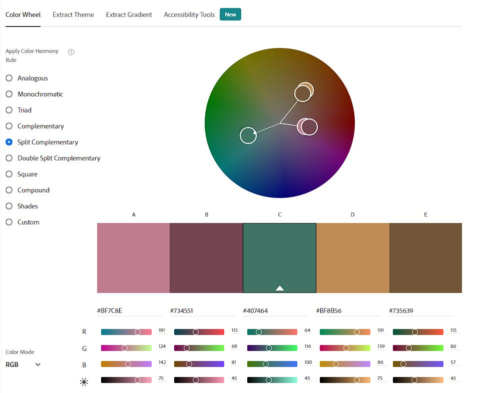

# What's Cooking?
(Developer: Vilayat Kleer)

[View the live website](https://herokuapp.com/)

## Table of Contents

1. [Project Goals](#project-goals)
    1. [User Goals](#user-goals)
    2. [Application Owner Goals](#application-owner-goals)
2. [User Experience](#user-experience)
    1. [Target Audience](#target-audience)
    2. [User Requirements and Expectations](#user-requirements-and-expectations)
3. [User Stories](#user-stories)
    1. [User](#user)
    1. [Returning User](#returning-user)
    3. [Application Owner](#application-owner)
4. [Technical Design](#technical-design)
5. [Technologies Used](#technologies-used)
    1. [Languages](#languages)
    2. [Tools](#tools)
    3. [Libraries](#libraries)
6. [Features](#features)
7. [Testing](#validation)
    1. [Python Validation](#python-validation)
    2. [Manual Testing - User Stories](#manual-testing---user-stories)
    3. [Automated Testing](#automated-testing)
8. [Bugs](#Bugs)
9. [Deployment](#deployment)
    1. [GitHub](#github)
    2. [Heroku](#heroku)
10. [Credits](#credits)
    1. [Code](#code)
11. [Acknowledgements](#acknowledgements)

## Project Goals

### User Goals
- Be able to create meal plans to become a better meal-prepper
- Be able to edit or delete my meal plans at any given time
- Have an overview of all my meal plans for a set week
- Get inspired by finding new recipes

### Application Owner Goals
- Create an application that helps users track and prep their meals
- Provide users with a database full of recipes for them to choose and get inspired by
- Provide feedback to users on any important action (CRUD, log in, log out etc.)
- Deliver an aesthetically pleasing design to the application that makes users want to come back

## User Experience

### Target Audience
- People who want to keep track of their daily meals
- Meal preppers who want an organised space for their meal plans
- Cooking enthusiasts who want to get inspired by new recipes without looking on multiple websites

### User Requirements and Expectations
- A simple, elegant application that anyone can use
- Clear feedback provided after performing an important action
- Providing a personal touch by referring to the users' username and first name throughout the application

## User Stories

### Anonymous User
1. As an anonymous user, I want to be able to view the home page, so I know what the application is about
2. As an anonymous user, I want to be able to view the recipe list, so I know what the application has to offer
3. As an anonymous user, I want to be able to create an account, so I can start using the application

### Registered User
4. As a registered user, I want to be able to log in with my account
5. As a registered user, I want to be able to create a meal plan for a specific date
6. As a registered user, I want to be able to add meals to a meal plan
7. As a registered user, I want to be able to edit any of my meal plans
8. As a registered user, I want to be able to delete any of my meal plans
9. As a registered user, I want to have a weekly overview of my meal plans in my meal planner
10. As a registered user, I want to be able to pick the first day of the week of my weekly overview
11. As a registered user, I want to be able to view the details of each recipe in the recipe list
12. As a registered user, I want to be able to view my account details on my profile page
13. As a registered user, I want to be able to delete my account on my profile page
14. As a registered user, I want to be able to log out when I'm done

### Application Owner
15. As the application owner, I want to be able to add new recipes to the recipe list
16. As the application owner, I want to be able to delete recipes from the recipe list
17. As the application owner, I want to restrict most of the applications' functionality for anonymous users to encourage them to create an account
18. As the application owner, I want users to stay on the application when they receive an HTTP response of 400, 403, 404 or 500
19. As the application owner, I want users to be able to contact me with a contact form
20. As the application owner, I want the users' input on forms to be validated
21. As the application owner, I want to provide a responsive application for all devices

## Design

### Colours
The colours I used for the application have been picked using the [Adobe Color Wheel](https://color.adobe.com/create/color-wheel). I first found a 'main' colour that I wanted to use (#407464, used in the bg-main class) before moving on to the other colours. The 'Split Complementary' colour harmony rule suggested a dark pink colour, which I took and customized to a soft grey-pink colour (#f5e4e4, used in the bg-accent class) to make it easier to look at and use in the application. Finally, I simply took the main colour and made it a few shades darker to use for the navbar and footer (#2e4b42, used in the bg-main-dark class).

Screenshot of Adobe Color Wheel

    

### Fonts
The fonts that I used are [Reem Kufi Fun](https://fonts.google.com/specimen/Reem+Kufi+Fun) for the logo, [Montserrat](https://fonts.google.com/specimen/Montserrat) for all the headings and [Quicksand](https://fonts.google.com/specimen/Quicksand) for all other text elements. They are all sans-serif fonts, but have a few distinct differences: The Montserrat font creates a nice contrast with the other text elements by having a simple design and bold font-weight, while the Quicksand font is more playful, yet legible. The Reem Kufi Fun font stands out from the other fonts with its unique 'W', which is why I found it to be suitable for the logo. All fonts have sans-serif as a fallback.

## Technical Design

## Technologies Used

### Languages
- [**Python**](https://www.python.org/)

### Tools
- [**Git**](https://git-scm.com/) was used for version control
- [**GitHub**](https://github.com/) was used as a remote repository to store the all project files
- [**Gitpod**](https://gitpod.io/) was used as the IDE to write the project code
- [**Google Sheets**](https://www.google.com/sheets/about/) was used to store the players' account details
- [**Heroku**](https://dashboard.heroku.com/) was used to deploy the project
- [**PEP8**](http://pep8online.com/) was used to validate my Python code

### Libraries
- [**library**](https://) 

## Features
The website has a total of x main features:

### Feature
- description

Screenshot of feature

    

## Testing

### Python Validation
The Python code has been validated using [Pep8 Validation Service](http://pep8online.com/) - no errors or warnings were found.

Screenshot of .py PEP8 Validation

    

### Manual Testing - User Stories

1. As a user, I want to be able to read the game instructions

| **Feature** | **Action** | **Expected Result** | **Actual Result** |
|-------------|------------|---------------------|-------------------|
| Feature | Action | Expected result | Works as expected |

Supporting Screenshots - User Story 1

    

### Automated Testing

## Bugs

| **Bug** | **Fix** |
|-------------|------------|
| Description | Fix - [link to commit](https://github.com/vkleer/CI_PP4_WhatsCooking/commit/) |

## Deployment

### GitHub
This website was deployed using Github Pages with the following steps:

1. Go to your Github Repository
2. Navigate to the 'Settings' page
3. On the left hand menu under 'Code and automationo', click on 'Pages'
4. Under 'Source', click on the 'Branch' dropdown element and set it to your main branch (in my case, this branch is called 'main')
5. Click on 'Save'
6. Refresh the page and you will be provided with a link to your deployed Github Page.

If you want to fork this repository, follow these steps:

1. Go to the Github repository (https://github.com/vkleer/CI_PP1_TD)
2. Click on the 'Fork' button in the top right corner under the navigation bar

If you want to clone this repository, follow these steps:

1. Go to the Github repository (https://github.com/vkleer/CI_PP1_TD)
2. Click on the 'Code' button above the list of files
3. Select your preferred way of cloning, I recommend using the 'GitHub CLI' option
4. Under 'GitHub CLI', click on the copy button to copy the clone command
5. In you IDE, open Git Bash
6. Navigate to the working directory where you want to clone this directory
7. Paste in the clone command you copied and press the 'enter' key to create the clone

### Heroku
This application has been deployed using Heroku with the following steps:

1. Login to [Heroku](https://id.heroku.com/login)
1. Go to your Heroku dashboard
3. In the top-right corner, click on the 'New' button, followed by the 'Create a new app' button
4. Enter an app name (it has to be unique) and choose your region under the 'Choose a region' dropdown menu.
5. Click on the 'Create app' button
6. On the next page, click on the 'Settings' tab 
7. Under 'Config Vars', click on 'Reveal Config Vars' to add a new Config var - this is where you can store sensitive data, like your Google service account key
8. Under 'Buildpacks' click on the 'Add buildpack' button to install additional dependencies. For this project the 'python' and 'nodejs' buildpacks were added, in that specific order
9. Click on the 'Deploy' tab
10. Under 'Deployment method', click on 'Github'. You can then search for your repository under 'Search for a repository to connect to'
11. Click on the 'Connect' button to connect your repository
12. On the next page, under 'Choose a branch to deploy' you can choose the branch you want to deploy your app from
13. Either click on the 'Enable Automatic Deploys' button under 'Automatic deploys' to have the app deploy automatically on each push you make to the branch, or click on the 'Deploy Branch' button under 'Manual deploy'
14. Wait for the app to build and be deployed. Once the app is ready, a message will be displayed saying 'App was successfully deployed' along with a button which takes you to your newly deployed app

## Credits

### Code

## Acknowledgements
I would like to thank:
- My mentor Mo Shami for providing me with advice and guidance for this project
- My partner Lauren Baker for helping me with testing and finding multiple bugs in the program